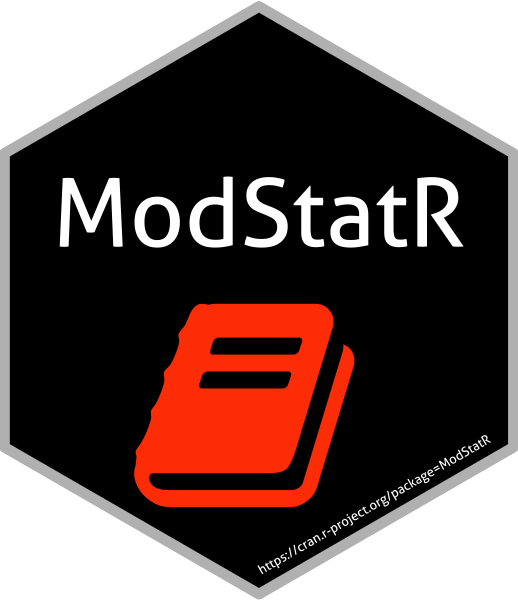

<!-- README.md is generated from README.Rmd. Please edit that file -->


# ModStatR 

# Modélisation statistique par la pratique avec R
## Frédéric Bertrand, Emmanuel Claeys et Myriam Maumy-Bertrand

<!-- badges: start -->
[](https://www.tidyverse.org/lifecycle/#stable)
[](https://www.repostatus.org/#active)
[](https://github.com/fbertran/ModStatR/actions)
[](https://codecov.io/gh/fbertran/ModStatR?branch=master)
[](https://cran.r-project.org/package=ModStatR)
[](https://cran.r-project.org/package=ModStatR)
[](https://github.com/github/fbertran/)
[](https://zenodo.org/badge/latestdoi/204068588)
<!-- badges: end -->

Le package ModStatR est un compagnon pour le livre [Modélisation statistique par la pratique avec R](https://www.dunod.com/sciences-techniques/modelisation-statistique-par-pratique-avec-r-cours-et-exercices-corriges).


[]

Ce site et les exemples qui y sont reproduits ont été créés par F. Bertrand and M. Maumy-Bertrand.

## Installation

Vous pouvez installer la dernière version du package ModStatR depuis le [CRAN](https://CRAN.R-project.org) with:


```r
install.packages("ModStatR")
```

Vous pouvez installer la dernière version du package ModStatR depuis le [github](https://github.com) with:


```r
devtools::install_github("fbertran/ModStatR")
```

## Code et résultats

* [Code et résultats du chapitre *1*](https://fbertran.github.io/ModStatR/articles/Chapitre1.html)
* [Code et résultats du chapitre *2*](https://fbertran.github.io/ModStatR/articles/Chapitre2.html)
* [Code et résultats du chapitre *3*](https://fbertran.github.io/ModStatR/articles/Chapitre3.html)
* [Code et résultats du chapitre *4*](https://fbertran.github.io/ModStatR/articles/Chapitre4.html)

Les sorties et le code de chaque chapitre sont également accessibles à l'aide de l'onglet "Code du livre".

## Solutions des exercices

* [Code et résultats du chapitre *1*](https://fbertran.github.io/ModStatR/articles/SolChapitre1.html)
* [Code et résultats du chapitre *2*](https://fbertran.github.io/ModStatR/articles/SolChapitre1.html)
* [Code et résultats du chapitre *3*](https://fbertran.github.io/ModStatR/articles/SolChapitre1.html)
* [Code et résultats du chapitre *4*](https://fbertran.github.io/ModStatR/articles/SolChapitre1.html)

Les solutions des exercices de chaque chapitre sont également accessibles à l'aide de l'onglet "Solutions des exercices".


Le répertoire démo inclus dans le package contient le code de tous les chapitres du livre ainsi que le code des solutions de tous les exercices du livre. La fonction demo permet d'y accéder.
